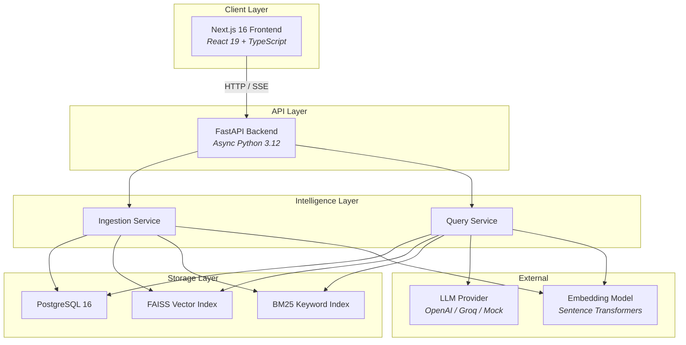
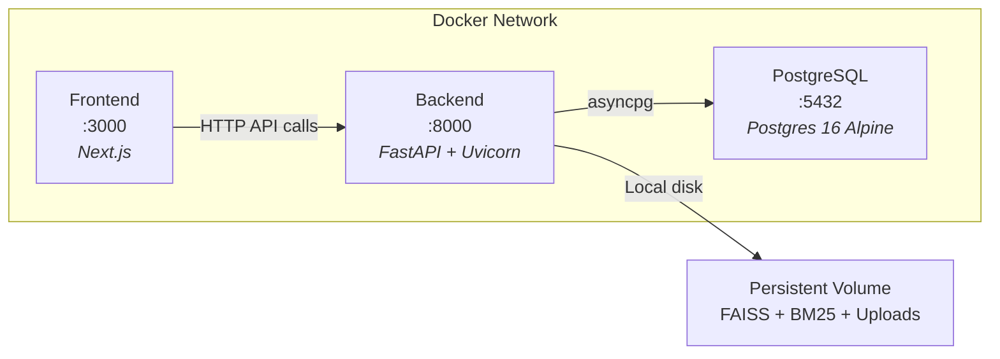
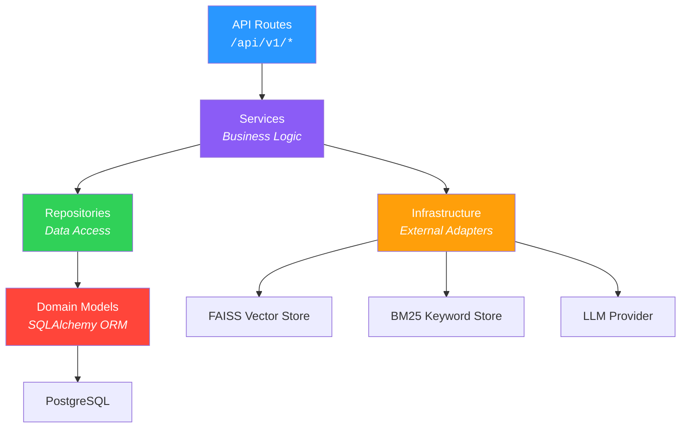
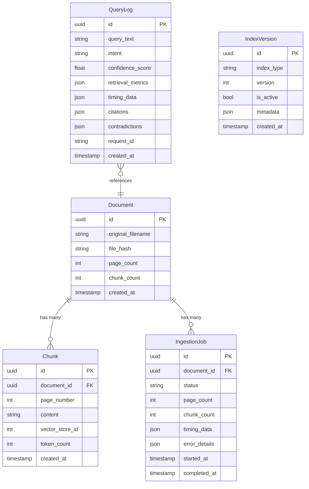
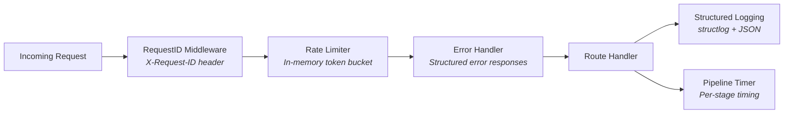
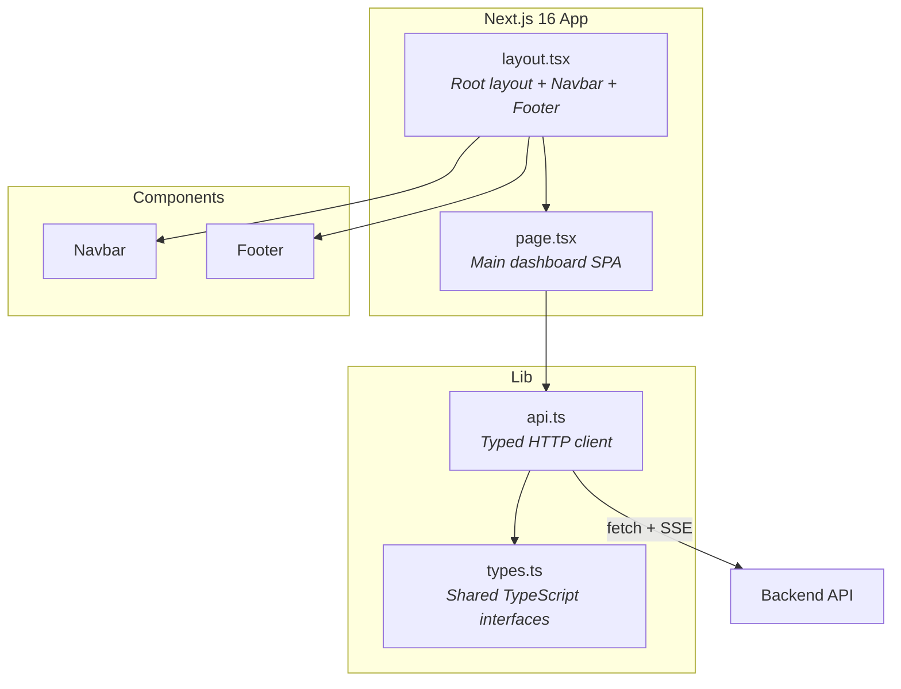
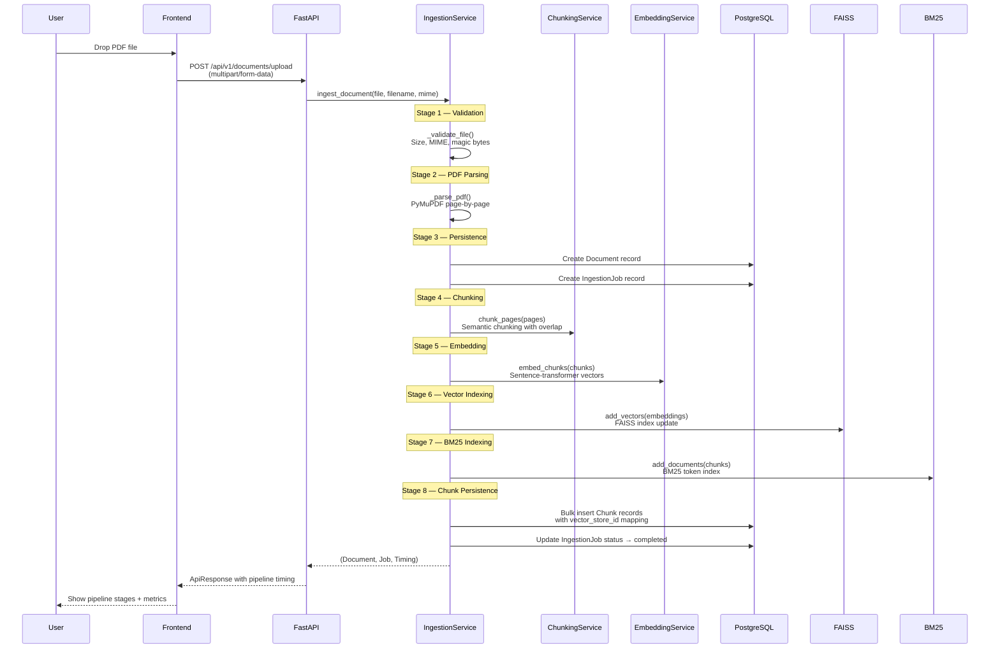
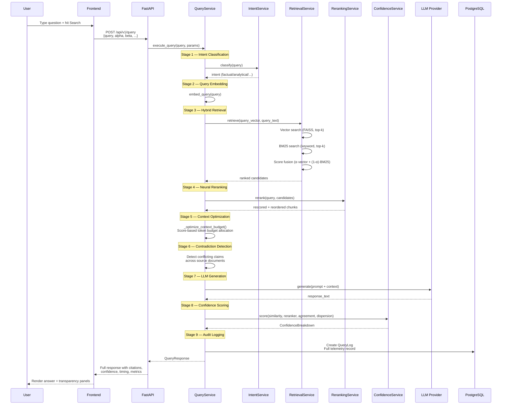

# CortexDocs ∞ — Architecture Documentation

> **Production-grade, fully observable, multi-document AI retrieval engine**

---

## Table of Contents

1. [System Overview](#system-overview)
2. [High-Level Design (HLD)](#high-level-design)
3. [Infrastructure & Deployment](#infrastructure--deployment)
4. [Backend — Low-Level Design](#backend--low-level-design)
5. [Frontend — Low-Level Design](#frontend--low-level-design)
6. [Data Flow: Ingestion Pipeline](#data-flow-ingestion-pipeline)
7. [Data Flow: Query Pipeline](#data-flow-query-pipeline)
8. [Design Decisions & Tradeoffs](#design-decisions--tradeoffs)

---

## System Overview

CortexDocs ∞ is a **Retrieval-Augmented Generation (RAG)** engine that combines hybrid search (vector + BM25), neural reranking, confidence scoring, and contradiction detection into a fully transparent document intelligence system.



---

## High-Level Design

### Core Architecture Principles

| Principle              | Implementation                                                                                     |
| ---------------------- | -------------------------------------------------------------------------------------------------- |
| **Full Observability** | Every pipeline stage is timed. Query logs store all intermediate results for replay and debugging. |
| **Hybrid Retrieval**   | Combines dense vector search (FAISS) with sparse keyword search (BM25) for superior recall.        |
| **Clean Architecture** | Domain models → Repositories → Services → API routes. Each layer has a single responsibility.      |
| **Async-First**        | SQLAlchemy 2.0 async sessions, async FAISS operations, non-blocking I/O throughout.                |
| **Feature Flags**      | Runtime-toggleable features (reranking, hybrid search) without redeployment.                       |

### Project Structure

```
cortexdocsx/
├── docker-compose.yml          # 3-service orchestration
├── .env.example                # Environment configuration
│
├── backend/                    # Python FastAPI application
│   ├── Dockerfile
│   ├── requirements.txt
│   ├── app/
│   │   ├── main.py             # App factory + lifespan management
│   │   ├── api/v1/             # REST endpoints
│   │   ├── core/               # Config, constants, dependencies, features
│   │   ├── domain/             # SQLAlchemy ORM models
│   │   ├── infrastructure/     # External system adapters
│   │   ├── middleware/         # Cross-cutting concerns
│   │   ├── observability/      # Logging + timing
│   │   ├── repositories/      # Data access layer
│   │   ├── schemas/            # Pydantic request/response models
│   │   └── services/           # Business logic orchestrators
│   ├── tests/                  # pytest test suite
│   └── evaluation/             # RAG quality evaluation scripts
│
└── frontend/                   # Next.js 16 application
    ├── src/
    │   ├── app/                # Pages + layout
    │   ├── components/         # Navbar, Footer
    │   └── lib/                # API client + TypeScript types
    └── package.json
```

---

## Infrastructure & Deployment

### Docker Compose Stack



| Service    | Image                | Port | Purpose                                                        |
| ---------- | -------------------- | ---- | -------------------------------------------------------------- |
| `postgres` | `postgres:16-alpine` | 5432 | Relational persistence for documents, chunks, jobs, query logs |
| `backend`  | Custom Dockerfile    | 8000 | FastAPI with Uvicorn ASGI server                               |
| `frontend` | Custom Dockerfile    | 3000 | Next.js SSR/CSR application                                    |

### Persistent Volumes

- **`cortexdocs_pgdata`** — PostgreSQL data directory
- **`cortexdocs_data`** — FAISS indices, BM25 indices, uploaded PDFs

---

## Backend — Low-Level Design

### Layer Architecture



---

### API Layer — `app/api/v1/`

| File                                                                                    | Endpoints                                                         | Purpose                                           |
| --------------------------------------------------------------------------------------- | ----------------------------------------------------------------- | ------------------------------------------------- |
| [health.py](file:///Users/ashutoshkumar/cortexdocsx/backend/app/api/v1/health.py)       | `GET /health`, `GET /health/detailed`                             | Liveness + readiness probes with subsystem status |
| [documents.py](file:///Users/ashutoshkumar/cortexdocsx/backend/app/api/v1/documents.py) | `POST /documents/upload`, `GET /documents`, `GET /documents/{id}` | PDF upload, document listing, detail fetch        |
| [query.py](file:///Users/ashutoshkumar/cortexdocsx/backend/app/api/v1/query.py)         | `POST /query`, `POST /query/stream`, `GET /query/{id}/replay`     | Synchronous query, SSE streaming, query replay    |
| [router.py](file:///Users/ashutoshkumar/cortexdocsx/backend/app/api/v1/router.py)       | —                                                                 | Aggregates all route prefixes under `/api/v1`     |

---

### Domain Models — `app/domain/models.py`



---

### Services Layer — `app/services/`

The **heart** of the application. Each service has a single responsibility:

| Service               | File                                                                                                        | Responsibility                                                                   |
| --------------------- | ----------------------------------------------------------------------------------------------------------- | -------------------------------------------------------------------------------- |
| **IngestionService**  | [ingestion_service.py](file:///Users/ashutoshkumar/cortexdocsx/backend/app/services/ingestion_service.py)   | Full upload pipeline: validate → parse PDF → chunk → embed → index → persist     |
| **QueryService**      | [query_service.py](file:///Users/ashutoshkumar/cortexdocsx/backend/app/services/query_service.py)           | Full query pipeline: intent → retrieve → rerank → compress → generate → score    |
| **ChunkingService**   | [chunking_service.py](file:///Users/ashutoshkumar/cortexdocsx/backend/app/services/chunking_service.py)     | Semantic-aware text chunking with overlap and page tracking                      |
| **EmbeddingService**  | [embedding_service.py](file:///Users/ashutoshkumar/cortexdocsx/backend/app/services/embedding_service.py)   | Sentence-transformer embedding generation for chunks and queries                 |
| **RetrievalService**  | [retrieval_service.py](file:///Users/ashutoshkumar/cortexdocsx/backend/app/services/retrieval_service.py)   | Hybrid retrieval (vector + BM25) with alpha-weighted score fusion                |
| **RerankingService**  | [reranking_service.py](file:///Users/ashutoshkumar/cortexdocsx/backend/app/services/reranking_service.py)   | Cross-encoder neural reranking of retrieved chunks                               |
| **ConfidenceService** | [confidence_service.py](file:///Users/ashutoshkumar/cortexdocsx/backend/app/services/confidence_service.py) | Multi-factor confidence scoring (similarity + reranker + agreement + dispersion) |
| **IntentService**     | [intent_service.py](file:///Users/ashutoshkumar/cortexdocsx/backend/app/services/intent_service.py)         | Query intent classification (factual, analytical, comparative, summarization)    |

---

### Infrastructure Layer — `app/infrastructure/`

| Component        | File                                                                                                  | Technology               | Purpose                                               |
| ---------------- | ----------------------------------------------------------------------------------------------------- | ------------------------ | ----------------------------------------------------- |
| **Database**     | [database.py](file:///Users/ashutoshkumar/cortexdocsx/backend/app/infrastructure/database.py)         | SQLAlchemy 2.0 + asyncpg | Async PostgreSQL connection pool with session factory |
| **Vector Store** | [vector_store.py](file:///Users/ashutoshkumar/cortexdocsx/backend/app/infrastructure/vector_store.py) | FAISS                    | Dense vector index for semantic similarity search     |
| **BM25 Store**   | [bm25_store.py](file:///Users/ashutoshkumar/cortexdocsx/backend/app/infrastructure/bm25_store.py)     | rank-bm25                | Sparse keyword index for lexical matching             |
| **LLM Provider** | [llm_provider.py](file:///Users/ashutoshkumar/cortexdocsx/backend/app/infrastructure/llm_provider.py) | OpenAI API / Mock        | Abstraction over LLM providers with streaming support |

---

### Repository Layer — `app/repositories/`

Implements the **Repository Pattern** for clean data access:

| Repository               | Manages        | Key Operations                                    |
| ------------------------ | -------------- | ------------------------------------------------- |
| `DocumentRepository`     | `Document`     | Create, find by hash, list with pagination        |
| `ChunkRepository`        | `Chunk`        | Bulk create, find by vector IDs, find by document |
| `IngestionRepository`    | `IngestionJob` | Create, update status, track timing               |
| `QueryLogRepository`     | `QueryLog`     | Create, find by ID for replay                     |
| `IndexVersionRepository` | `IndexVersion` | Version tracking, rollback support                |

All repositories extend a `BaseRepository` with shared session management and error handling.

---

### Middleware & Observability



| Middleware              | Purpose                                                               |
| ----------------------- | --------------------------------------------------------------------- |
| **RequestIDMiddleware** | Generates/propagates `X-Request-ID` for distributed tracing           |
| **RateLimitMiddleware** | Token-bucket rate limiting with configurable windows                  |
| **ErrorHandler**        | Catches exceptions, returns structured `ApiResponse` with error codes |

---

## Frontend — Low-Level Design

### Architecture



### Key Files

| File                                                                                     | Purpose                                                                              |
| ---------------------------------------------------------------------------------------- | ------------------------------------------------------------------------------------ |
| [layout.tsx](file:///Users/ashutoshkumar/cortexdocsx/frontend/src/app/layout.tsx)        | Root HTML layout with Google Fonts, Navbar, and Footer                               |
| [page.tsx](file:///Users/ashutoshkumar/cortexdocsx/frontend/src/app/page.tsx)            | Main SPA: Hero, Dashboard with tabbed Ingestion/Retrieval views                      |
| [api.ts](file:///Users/ashutoshkumar/cortexdocsx/frontend/src/lib/api.ts)                | Centralized API client with `apiFetch<T>` generic, SSE streaming via `streamQuery()` |
| [types.ts](file:///Users/ashutoshkumar/cortexdocsx/frontend/src/lib/types.ts)            | 15+ TypeScript interfaces mirroring backend Pydantic schemas                         |
| [Navbar.tsx](file:///Users/ashutoshkumar/cortexdocsx/frontend/src/components/Navbar.tsx) | Sticky translucent navigation bar                                                    |
| [Footer.tsx](file:///Users/ashutoshkumar/cortexdocsx/frontend/src/components/Footer.tsx) | Multi-column footer with directory links                                             |

### Frontend Technologies

| Technology          | Purpose                                                          |
| ------------------- | ---------------------------------------------------------------- |
| **Next.js 16**      | React framework with Turbopack, SSR/CSR hybrid                   |
| **React 19**        | UI rendering with hooks and concurrent features                  |
| **TypeScript**      | Full type safety across all components                           |
| **Framer Motion**   | Smooth page transitions, component animations, layout animations |
| **Lucide React**    | Consistent icon system                                           |
| **Tailwind CSS v4** | Utility-first styling with custom theme extension                |

---

## Data Flow: Ingestion Pipeline

The complete journey of a PDF document from upload to indexed knowledge:



### Pipeline Stages (Timed)

| #   | Stage                    | What Happens                                                            |
| --- | ------------------------ | ----------------------------------------------------------------------- |
| 1   | **Validation**           | File size check, MIME type verification, PDF magic bytes inspection     |
| 2   | **PDF Parsing**          | PyMuPDF extracts text page-by-page with metadata                        |
| 3   | **Document Persistence** | `Document` + `IngestionJob` records created in PostgreSQL               |
| 4   | **Chunking**             | Semantic-aware splitting with configurable overlap and max token limits |
| 5   | **Embedding**            | Sentence-transformer generates dense vectors for each chunk             |
| 6   | **Vector Indexing**      | Vectors added to FAISS index with ID mapping                            |
| 7   | **BM25 Indexing**        | Tokenized text added to BM25 keyword index                              |
| 8   | **Chunk Persistence**    | All `Chunk` records bulk-inserted with `vector_store_id` foreign keys   |

---

## Data Flow: Query Pipeline

The complete journey from user question to verified, cited answer:



### Query Pipeline Stages (Timed)

| #   | Stage                       | What Happens                                                                     |
| --- | --------------------------- | -------------------------------------------------------------------------------- |
| 1   | **Intent Classification**   | Classifies query as factual, analytical, comparative, or summarization           |
| 2   | **Query Embedding**         | Generates dense vector representation of the user's question                     |
| 3   | **Hybrid Retrieval**        | Parallel vector (FAISS) + keyword (BM25) search with alpha-weighted score fusion |
| 4   | **Neural Reranking**        | Cross-encoder rescores and reorders candidates for relevance                     |
| 5   | **Context Optimization**    | Greedy token-budget allocation — highest-scored chunks fill context first        |
| 6   | **Contradiction Detection** | Cross-document entity comparison to surface conflicting claims                   |
| 7   | **LLM Generation**          | Context-grounded answer generation with citation instructions                    |
| 8   | **Confidence Scoring**      | Four-factor score: similarity + reranker + agreement + dispersion                |
| 9   | **Audit Logging**           | Full telemetry (timing, scores, citations, contradictions) persisted for replay  |

---

## Design Decisions & Tradeoffs

### Why Hybrid Retrieval (Vector + BM25)?

> Pure vector search struggles with exact keyword matching (product codes, version numbers). Pure BM25 misses semantic similarity. Combining them with tunable **α** gives the best of both worlds.

### Why FAISS over Pinecone/Weaviate/Qdrant?

> **Zero cloud dependency.** CortexDocs runs fully on-premise. FAISS is battle-tested (Meta), fast, and requires no external service. The tradeoff is manual index management — solved via `IndexVersion` for snapshots and rollback.

### Why Repository Pattern over raw SQL?

> Clean separation of data access from business logic. Repositories return domain objects, services compose them. This makes the query service testable without a real database.

### Why Full Audit Logging (QueryLog)?

> Every query execution is **deterministically replayable**. The `QueryLog` stores all intermediate results — retrieval scores, reranking positions, confidence components. Critical for debugging production issues and evaluating RAG quality over time.

### Why Async Throughout?

> PDF parsing and embedding are I/O-bound. Async PostgreSQL (asyncpg) + async FAISS operations + non-blocking HTTP ensure the server handles concurrent uploads and queries without thread-pool exhaustion.

---

> **CortexDocs ∞** — Built for precision. Observable by design.
